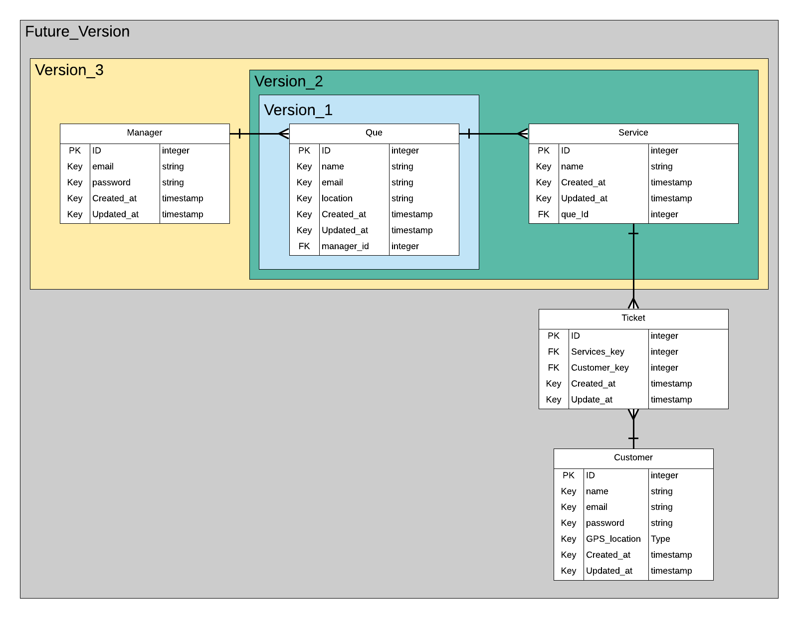

# Q-me

The Q-me project is a network of queue managment systems that aims to help crowded places deal with visitors. Hopefully you'll never stand in a physical queue ever again. you'd be able to reserve your spot before reaching the place you want. If your turn is up before you reach you can simply pass your turn and gain more time to reach. This will hopefully save your precious time to do more important stuff.

# Overview

The app is being developed in stages to reduce the complexity of development. version_1 should enable location_admin to register in the app and fill in their info. version_2 should enable admins to add in services to their location. version_3 should enable many users to obtain tickets for many services.

# Wireframe

1. The app is designed such that customers can obtain their tickets for services without having to register. the index page provides multiple options for finding the store. you can find stores that are nearby if for example you were at a mall. alternatively the user can search for a prticular location. otherwise, registered users can save their often visited places.

2. any of the options above should lead you to the location services provided. where a user can select the service needed.

3. That leads the user to the waiting page where it shows user's number in the queue. along with estimated time of wait. the app prompts the user when their turn is about to come up if they are ready. if not they can gain more time by allowing their turn to pass. if a user can't make it anymore there is an option to forfeit their turn.

# Branch managment

This project was a great way of getting used to branching habit. the goal is to always have a good working master branch and keeping the development work on branches. the branches can be kept for referance as a history checkpoint that can be revisited when needed to compare for debugging.

# User story

1. The admin of a Que location needs to login to create a Que. The admin is the only role that is allowed to add, delete and disable queus and services

2. The visitor login is optional only to allow a user to save favourit Ques in their account. otherwise a guest user is able to obtain a ticket.

3. ...