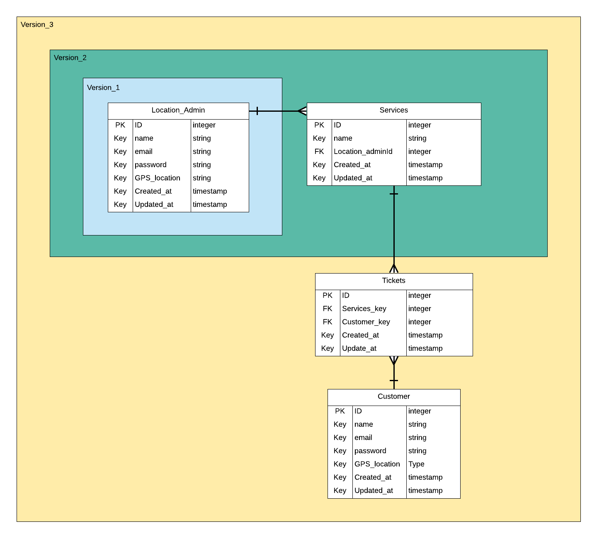

# Q-me

The Q-me project is a network of queue managment systems that aims to help crowded places deal with visitors. Hopefully you'll never stand in a physical queue ever again. you'd be able to reserve your spot before reaching the place you want. If your turn is up before you reach you can simply pass your turn and gain more time to reach. This will hopefully save your precious time to do more important stuff.

# Overview

